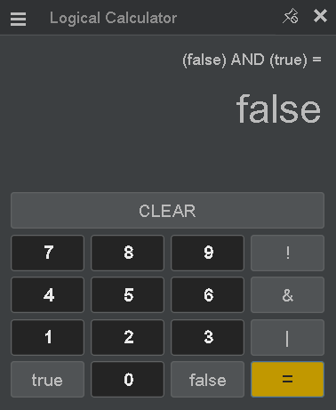

## **Project's Name:**
# OODBS-Praktikum-01

## **Description**
Just a Java exercise demo project for **OODBS** class at **Bakrie University**.

This project contains two simple Calculators:
- A simple standard calculator inspired by Windows 10's Standard Calculator, I use Formdev's **FlatLaf** library for to imitate the flat and dark Look-and-Feel of the Windows 10's calculater. 
- Also a very simple logical calculator for 'NOT', 'AND', and 'OR' operation.
- (Update) I added the temperature measures converter that include *Celsius* (°C), *Fahrenheit* (°F), *Kelvin* (K), *Rankine* (°R), *Delisle* (°De), *Newton* (°N), *Réaumur* (°Ré), and *Rømer* (°Rø) measurement units.

I use **Microsoft VS Code** for editor.

---
## **File structure:**
### Source files:
  - src
    - Main.java
    - controllers
      - Calculator.java
      - Logicalc.java
      - Temperature.java    <-- ~~*was going to add temperature meassures unit converter, but abandoned it due to dateline.. only had about two days to write this (lazy me, for 'forgetting' the assignment.. :P)*~~
    - components
      - ImagePanel.java <-- *a custom JPanel extension class that allows to have image as its background*
    - etc
      - Constants.java  <-- *a final class that contains most used colors and fonts styles across classes*
      - Routines.java    <-- *another final class that holds the most used routines across the other classes*
  - lib
      - flatlaf-2.5.jar      <-- [*Formdev's FlatDarkLaf library*](https://www.formdev.com/flatlaf/#download)
  - bin                      <-- *contains compiler generated binary files*
  - images
    - icons      <-- *contains icon image files used in the app menus*
    - screenshot <-- *contains screenshot image files of the app (as shown below)*

## **Screenshots:**

    
    
    
    

    
    
    
    

---
# Thanks to Ms. Dita Nurmadewi for the lectures

---
---

## **Here comes the auto-generated texts on _Getting Started_ with Java on VS Code**

Welcome to the VS Code Java world. Here is a guideline to help you get started to write Java code in Visual Studio Code.

### Folder Structure

The workspace contains two folders by default, where:

-- `src`: the folder to maintain sources
-- `lib`: the folder to maintain dependencies

Meanwhile, the compiled output files will be generated in the `bin` folder by default.

> If you want to customize the folder structure, open `.vscode/settings.json` and update the related settings there.

### Dependency Management

The `JAVA PROJECTS` view allows you to manage your dependencies. More details can be found [here](https://github.com/microsoft/vscode-java-dependency#manage-dependencies).
