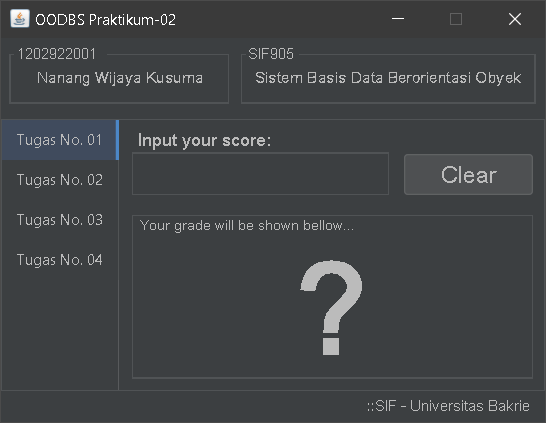
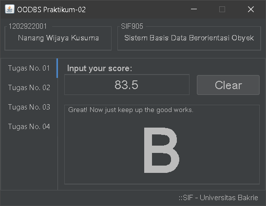
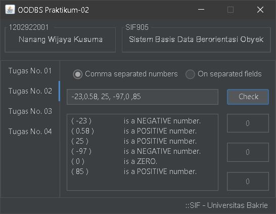
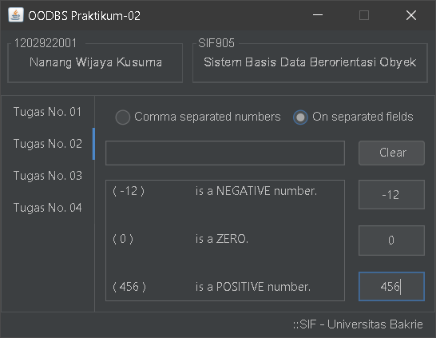
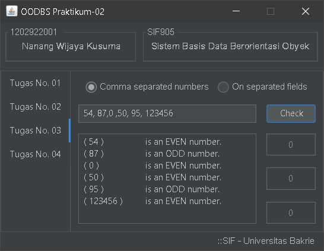
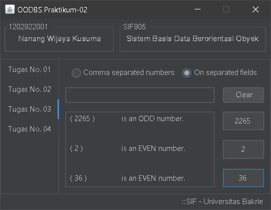
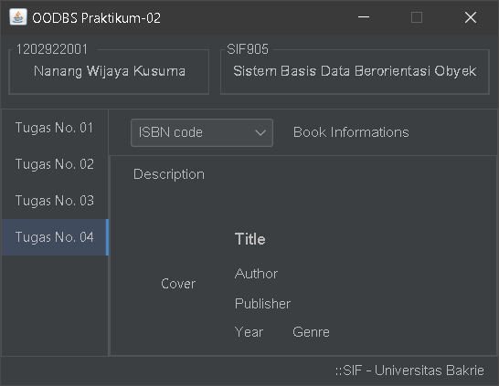
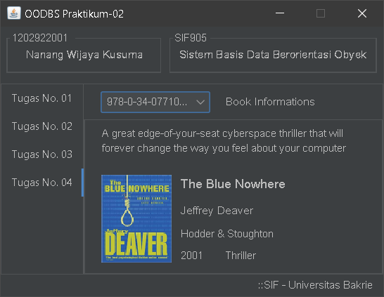

## **Project's Name:**
# Praktikum-01

## **Description**
Just a Java exercise demo project for **OODBS** class at **Bakrie University**.

- This project contains four tabs which each demonstrates of basic numerical manipulation.
    - The *first* tab show case the basic conversion of numerical score into grade classification.
    - The *second* tab checks whether the given number(s) is a positive, negative, or a zero.
    - The *third* tab also checks whether the given number(s) is an even or odd number.
    - The *fourth* tab show case the usage of integer number in *switch-case*.
- Through them all, it also demonstrate the various way of implementing an *event listener* for action, item, and key events.
- It is also demonstrate a way of loading/displaying image using java awt and javax imageio.

As always, I use **Microsoft VS Code** for editor.

---
## **File structure:**
### Source files:
  - src
    - App.java               <-- *main file which hold the JTabbedPane for the tabs*
    - Controllers
      - Tab01Panel.java      <-- *for the first tab*
      - Tab02Panel.java      <-- *for the second tab*
      - Tab03Panel.java      <-- *for the third tab*
      - Tab04Panel.java      <-- *for the fourth tab*
  - lib
      - flatlaf-2.5.jar      <-- [*Formdev's FlatDarkLaf library*](https://www.formdev.com/flatlaf/#download) *for the dark flat look-and-feel*
  - bin                      <-- *contains compiler generated binary files*
  - screeshot                <-- *contains screenshot image files of the app (as shown below)*

### Image files:
        

---

---
---

## **Here comes the auto-generated texts on _Getting Started_ with Java on VS Code**

Welcome to the VS Code Java world. Here is a guideline to help you get started to write Java code in Visual Studio Code.

### Folder Structure

The workspace contains two folders by default, where:

-- `src`: the folder to maintain sources
-- `lib`: the folder to maintain dependencies

Meanwhile, the compiled output files will be generated in the `bin` folder by default.

> If you want to customize the folder structure, open `.vscode/settings.json` and update the related settings there.

### Dependency Management

The `JAVA PROJECTS` view allows you to manage your dependencies. More details can be found [here](https://github.com/microsoft/vscode-java-dependency#manage-dependencies).

