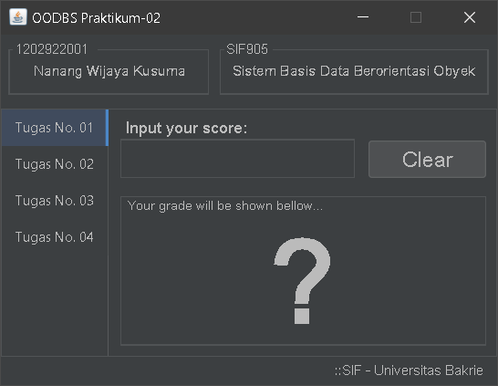
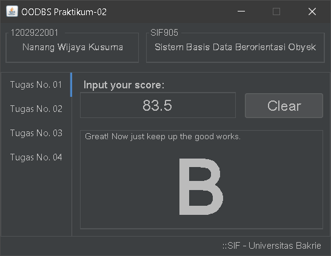
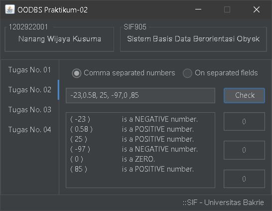
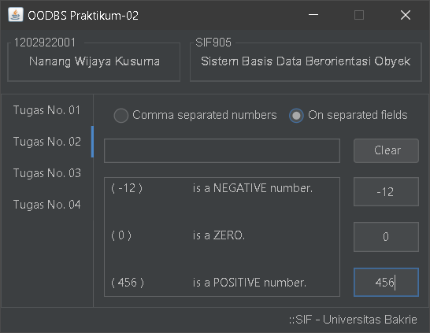
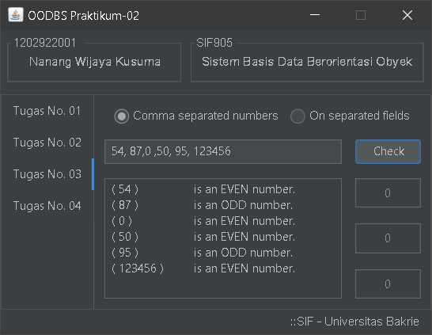
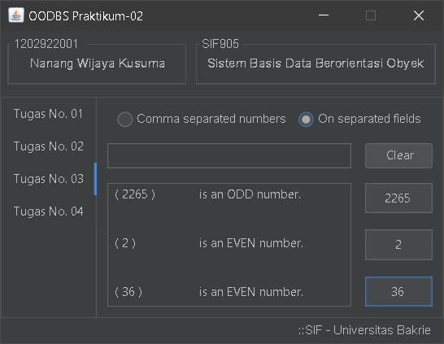
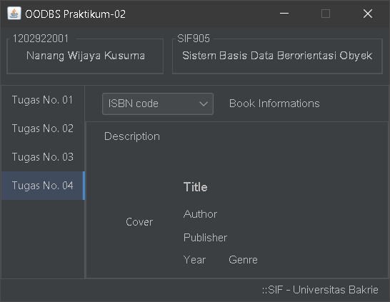
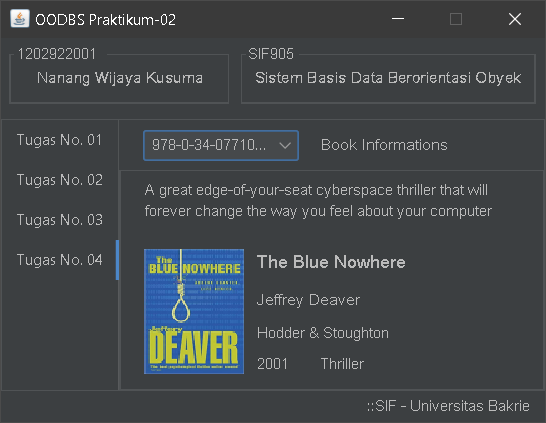

## **Project's Name:**
# OODBS-Praktikum-02

## **Description**
Just a Java exercise demo project for **OODBS** class at **Bakrie University**.

- This project contains four tabs which each demonstrates of basic numerical manipulation.
    - The *first* tab show case the basic conversion of numerical score into grade classification.
    - The *second* tab checks whether the given number(s) is a positive, negative, or a zero.
    - The *third* tab also checks whether the given number(s) is an even or odd number.
    - The *fourth* tab show case the usage of integer number in *switch-case*.
- Through them all, it demonstrate a way of using layout, and some way of implementing an *event listener* (action, item, and key events).
- As well as demonstrating a way of creating *model class of data objects* (!? - *not really sure if that's what its called*).

As always, I use **Microsoft VS Code** for editor.

---
## **File structure:**
### Source files:
  - src
    - Main.java         <-- *main file which hold the JTabbedPane for the tabs*
    - controllers       <-- *package for the tabs*
      - Tab01Panel.java
      - Tab02Panel.java
      - Tab03Panel.java
      - Tab04Panel.java
    - etc
      - Constants.java  <-- *a final class that contains most used colors and fonts styles across classes*
      - Modules.java    <-- *another final class that holds the most used routines across the other classes*
    - models
      - Book.java <-- *a class that holds the book data structures*
  - lib
      - flatlaf-2.5.jar      <-- [*Formdev's FlatDarkLaf library*](https://www.formdev.com/flatlaf/#download) *for the dark flat look-and-feel*
  - bin                 <-- *contains compiler generated binary files*
  - images
    - icons             <-- *contains icon image files used in the app menus*
    - thumbs            <-- *contains thumbnail-sized image files of book's covers*
    - screenshots        <-- *contains screenshot image files of the app (as shown below)*

### **Screenshots:**

    
    
    
    

    
    
    
    

---

---
---

## **Here comes the auto-generated texts on _Getting Started_ with Java on VS Code**

Welcome to the VS Code Java world. Here is a guideline to help you get started to write Java code in Visual Studio Code.

### Folder Structure

The workspace contains two folders by default, where:

-- `src`: the folder to maintain sources
-- `lib`: the folder to maintain dependencies

Meanwhile, the compiled output files will be generated in the `bin` folder by default.

> If you want to customize the folder structure, open `.vscode/settings.json` and update the related settings there.

### Dependency Management

The `JAVA PROJECTS` view allows you to manage your dependencies. More details can be found [here](https://github.com/microsoft/vscode-java-dependency#manage-dependencies).

